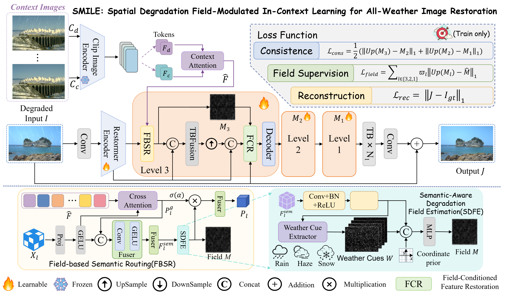
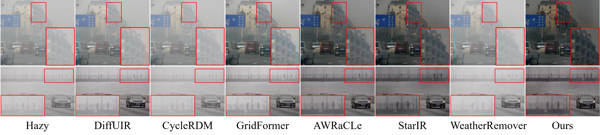
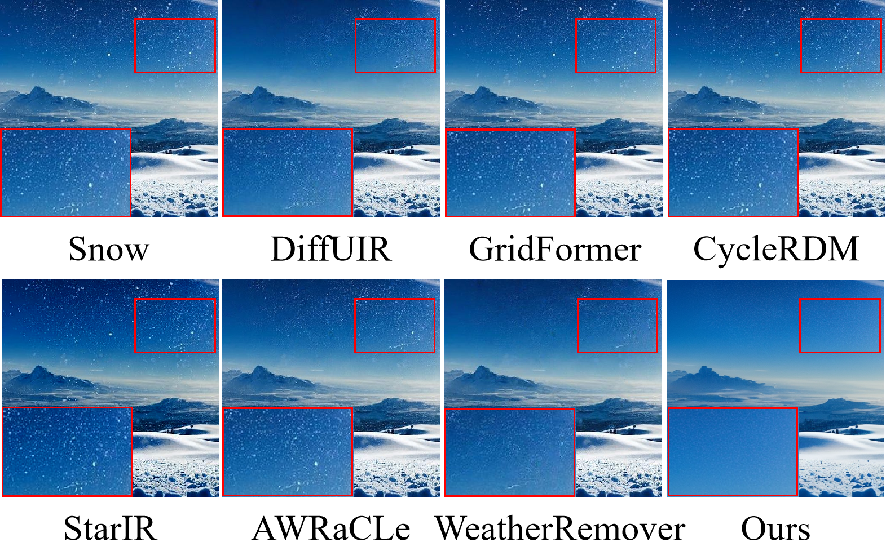

# *SMILE*: Spatial Degradation Field-Modulated In-Context Learning for All-Weather Image Restoration

<div class="content has-text-justified">
<p>
Comparison between existing restoration paradigms and the proposed spatial degradation field-modulated paradigm. Existing methods mainly rely on global descriptions, coordinate-aware modulation, or prior-guided restoration, whereas SMILE models degradation as a continuous spatial field to guide all-weather restoration.
</p>
</div>

<hr />

> **Abstract:** *Adverse weather image restoration aims to recover clear visual content from images degraded by complex weather conditions such as rain, haze, and snow. Existing unified restoration methods typically rely on global or coarsely aggregated semantic priors to handle coupled weather degradations within a single framework. However, such holistic modeling insufficiently characterizes the inherent spatial heterogeneity of degraded images, leading to indiscriminate restoration behaviors: severely degraded regions may remain under-restored, while lightly degraded regions can be over-corrected. To address this issue, we propose SMILE, a spatial degradation field-modulated in-context learning framework for all-weather image restoration. Instead of representing weather degradation as discrete category labels or global attributes, SMILE models it as a continuous spatial response for restoration control, which jointly coordinates context-prior routing and low-level feature restoration. Specifically, we develop Field-Based Semantic Routing (FBSR) to selectively enhance or suppress in-context priors at each restoration scale according to local degradation responses. Meanwhile, we introduce Field-Conditioned Feature Restoration (FCR), which explicitly injects the spatial degradation field into the decoding stage for spatially adaptive modulation of restoration features. To facilitate stable learning of this spatial control representation, we further extract weather-aware cues as auxiliary structural constraints. Extensive experiments on multiple synthetic and real-world adverse weather benchmarks demonstrate that SMILE achieves favorable quantitative performance and perceptual quality, while exhibiting spatial restoration behaviors that better align with local degradation distributions. These results demonstrate the effectiveness of spatial degradation field modulation as a restoration control mechanism for all-weather image restoration.* 
<hr />

## Method

</img>
<p>
Overall architecture of the proposed SMILE framework. Given a degraded query image C_d and degradation-related context image C_c pairs, SMILE extracts context priors with a frozen CLIP encoder and restores the image using a multi-scale encoder-decoder network. At each decoding scale, SDFE inside FBSR estimates a spatial degradation field F, which jointly guides context-prior routing and restoration feature modulation in FCR. The final restored image J is obtained by adding the predicted residual to the degraded input I.
</p>

📄 Preparation
===========================
## Installation

Clone the repository and create a new conda environment with Python=3.10. Install requirements.

```bash
git clone https://github.com/wenchao-tech/Smile.git
cd Smile

conda create -n Smile python=3.10 -y
conda activate Smile
pip install -r requirements.txt
```

## 👉 Datasets and Checkpoint Download

Download the training and test data from [here](https://livejohnshopkins-my.sharepoint.com/:u:/g/personal/sambasa2_jh_edu/EYH5NpJv-lZFnBDRCAIpbgAB4juN0XihZBZgxaSz07kGrg?e=kRHe1x). Extract to ```<data_directory>```. We appreciate the data provided by AWRaCLe.
The dataset structure should look like
```
<data_directory>
└── data_awracle
    ├── CSD
    ├── Rain13K
    ├── RESIDE
    ├── Snow100k
    ├── Train
    └── Train_clip
```

The pre-trained model will be released after employment.

## 🚀 Training and Test

### Training

To train the model from scratch on the datasets mentioned in the paper:

```
bash train.sh
```
Specify arguments ```--derain_dir, --dehaze_dir``` and ```desnow_dir``` as per your ```<data_directory>```. Additional arguments can be found in the ```options.py``` file.

### Testing

After training or when using a pre-trained model, run the test script:

```
bash test.sh
```

## 📊 Results
### Dehazy Results




### Derain Results


### Desnow Results





### Acknowledgements
We appreciate the data and code provided by [AWRaCLe](https://github.com/sudraj2002/AWRaCLe)! We thank the authors for sharing the code!
