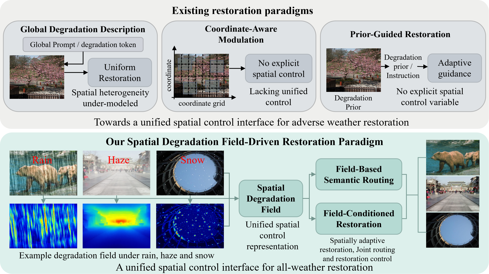

# *SMILE*: Spatial Degradation Field-Modulated In-Context Learning for All-Weather Image Restoration

Comparison between existing restoration paradigms and the proposed spatial degradation field-modulated paradigm. Existing methods mainly rely on global descriptions, coordinate-aware modulation, or prior-guided restoration, whereas SMILE models degradation as a continuous spatial field to guide all-weather restoration.

